<h1 align="center"> Hi 👋, I'm Debugsvg </h1>

  <em>Un développeur Full Stack passionné</em>

  
  

🚀 À propos de moi

🔭 Je suis actuellement Étudiant en Informatique embarquée
🌱 J'apprends actuellement Kubernetes et Ansible
💬 Pose-moi des questions sur Qt et Python
⚡ Fun fact : J'ai déjà participé à une RoboCup !

🛠️ Langages & Outils

  

📊 Statistiques GitHub

  
  &nbsp;
  

